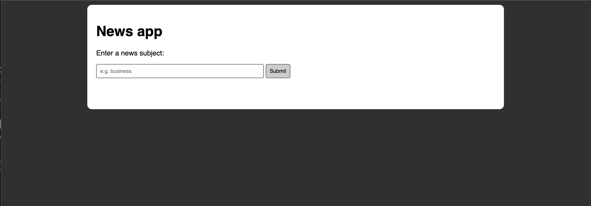
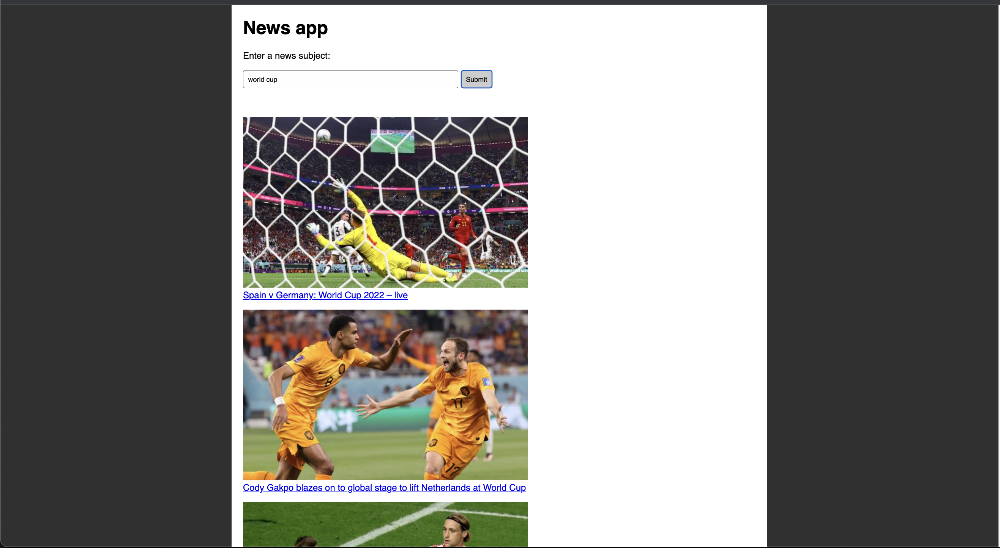

# News Web Application

This single page web app uses the Guardian newspaper API to allow users to search for news articles. The API grabs 10 news headlines and display them on the page. Clicking on a headline will link the user to the actual article page on the Guardian's website.

### Technologies

Languages: JavaScript, CSS, and HTML.
Testing: Jest and the `esbuild` build tool.

You're strongly encouraged to use the same tools and libraries you've been learning this
week:
 * Jest to write your tests
 * The [`jest-fetch-mock`](https://www.npmjs.com/package/jest-fetch-mock) module (or
   similar) to mock `fetch` requests (so you don't request the API when running tests!)
 * A build tool such as `esbuild` to bundle files together

### User Stories

```
As a busy politician
So I know what the big stories of the day are
I can see all of today's headlines in one place
```

```
As a busy politician
So that I have something nice to look at
I can see a relevant picture to illustrate each news article when I browse headlines
```

```
As a busy politician
So I can get a few more details about an important story
I can click a news article title which links to the original article
```

```
As a busy politician
So I can search what I want to read about
I can specify a search query on the page and get articles matching this search
```

### Further work

* Add a summary text for each article using use the [Aylien API endpoint](https://docs.aylien.com/), by integrating and calling another HTTP endpoint from a different API.
* Adapt site for mobile.
* Allow user to input the number of search results
* Break search results into pages.

### Screenshots



